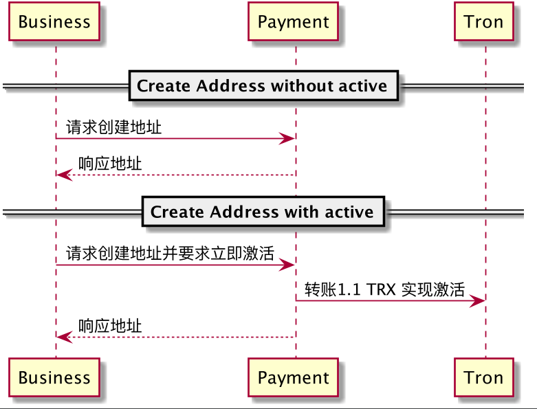
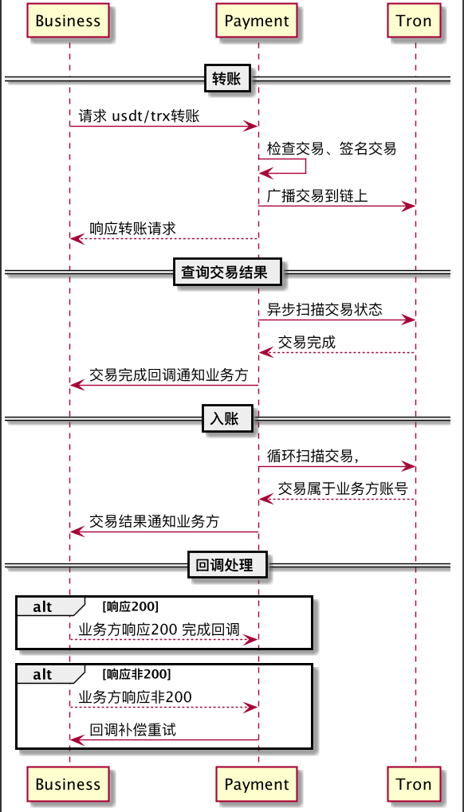
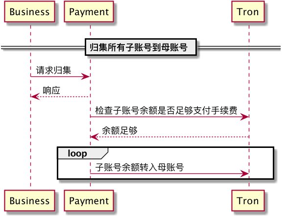

# USDT交易

目前对接波场，支持币种 如下：TRX、TRC20,其中TRC20 在测试时币种名称为：BBT，正式为USDT

## 账户

账户实际上是一个公开地址+ 一个私钥。私钥会以文件方式保存在服务器（需要严格保管）。账号创建并不会立即激活，但是会提供一个立即激活的选项。立即激活会自动向新建的账号转一笔1.1 个 TRX 来实现激活。

建议立即激活账户使用于每个用户固定一个地址的场景，非激活状态的地址可以用于一次性交易的地址

### 创建账户

#### 创建流程




**接口地址**:  `/v1/account`

 **请求方法**:    `POST`

**请求数据类型**：`application/json`

| 参数名称    | 参数说明                                                    | 是否必须 | 数据类型 |
| ----------- | ----------------------------------------------------------- | -------- | -------- |
| active      | 是否立即激活                                                | false    | boolean  |
| callBackUrl | 该账户地址的所有交易都会通过该url 异步[回调](#交易回调)通知 | true     | string   |
| chain       | 该地址隶属哪个链。值: Tron                                  |          |          |
| requestId   | 请求id，唯一性。每一个请求都要使用不同的id                  | false    | string   |
| sign        | 验签，统一签名参考 [签名](#签名) 章节                       | true     | string   |

**请求示例**:


```javascript
{
  "active": true,
  "callBackUrl": "https://you.server.com/api/callback",
  "requestId": "",
  "chain":"Tron",
  "sign": ""
}
```

**响应参数**:


| 参数名称    | 参数说明   | 类型   |
| ----------- | ---------- | ------ |
| address     | 创建的地址 | string |
| callBackUrl | 回调地址   | string |

**响应示例**:

```javascript
{
  "address": "",
  "callBackUrl": ""
}
```


### 查询账户资产

**接口描述**:  查询地址的所有资产信息；可能存在的资产包括：BBT（测试币，测试链上才有）、TRX(测试网和主网)、USDT（主网，如果有的话）

**接口地址**:`/v1/asset/{address}`

**请求方式**:`GET`

**请求数据类型**:`application/json`

**响应数据类型**:`*/*`

**请求参数**:


| 参数名称 | 参数说明 | 请求类型 | 是否必须 | 数据类型 | schema |
| -------- | -------- | -------- | -------- | -------- | ------ |
| address  | address  | path     | true     | string   |        |

| 状态码 | 说明                           | schema    |
| ------ | ------------------------------ | --------- |
| 200    | OK，非200 的请求均代表请求失败 | Json body |


**响应参数**:


| 参数名称     | 参数说明                      | 类型           | schema         |
| ------------ | ----------------------------- | -------------- | -------------- |
| balance      | 余额                          | string         |                |
| contractName | 合约缩写，合约类型:TRX，TRC20 | string         |                |
| precision    | 精度                          | integer(int32) | integer(int32) |

**响应示例**:

```javascript
[
  {
    "balance": "",
    "contractName": "",
    "precision": 0
  }
]
```

### 查询流水

**接口地址**:`/v1/transaction`


**请求方式**:`GET`


**请求数据类型**:`application/x-www-form-urlencoded`


**响应数据类型**:`*/*`


**接口描述**:


**请求参数**:


| 参数名称       | 参数说明                       | 请求类型 | 是否必须 | 数据类型       |
| -------------- | ------------------------------ | -------- | -------- | -------------- |
| page.pageNum   | 当前页码                       | query    | false    | integer(int32) |
| page.pageSize  | 每页条数                       | query    | false    | integer(int32) |
| page.startTime | 起始时间 (yyyy-MM-dd HH:mm:ss) | query    | false    | string         |
| page.endTime   | 结束时间 (yyyy-MM-dd HH:mm:ss) | query    | false    | string         |
| page.sort      |                                | query    | false    | string         |
| page.order     | Ordering - asc or desc         | query    | false    | string         |
| keywords       | 关键字                         | query    | false    | string         |
| ownerAddress   | 转出账号                       | query    | false    | string         |
| toAddress      | 转入账号                       | query    | false    | string         |
| contractName   | 资产类型：TRX、TRX20           | query    | false    | string         |
| type           | 流水类型                       | query    | false    | integer(int32) |
| status         |                                | query    | false    | integer(int32) |


**响应状态**:


| 状态码 | 说明 |
| ------ | ---- |
| 200    | OK   |

**响应参数**:


| 参数名称                  | 参数说明                                                 | 类型           | schema           |
| ------------------------- | -------------------------------------------------------- | -------------- | ---------------- |
| endRow                    |                                                          | integer(int32) | integer(int32)   |
| firstPage                 |                                                          | integer(int32) | integer(int32)   |
| hasNextPage               |                                                          | boolean        |                  |
| hasPreviousPage           |                                                          | boolean        |                  |
| isFirstPage               |                                                          | boolean        |                  |
| isLastPage                |                                                          | boolean        |                  |
| lastPage                  |                                                          | integer(int32) | integer(int32)   |
| list                      |                                                          | array          | TransactionLogPo |
| &emsp;&emsp;amount        | 转账金额                                                 | string         |                  |
| &emsp;&emsp;contractName  | 资产类型：TRX、TRC20                                     | integer(int32) |                  |
| &emsp;&emsp;createTime    |                                                          | Timestamp      | Timestamp        |
| &emsp;&emsp;fee           | 转账手续费                                               | string         |                  |
| &emsp;&emsp;id            | id                                                       | integer(int64) |                  |
| &emsp;&emsp;message       | 转帐信息                                                 | string         |                  |
| &emsp;&emsp;ownerAddress  | 付款地址                                                 | string         |                  |
| &emsp;&emsp;precision     | 转账金额精度                                             | integer(int32) |                  |
| &emsp;&emsp;startBlockNum | 转账时块号                                               | integer(int64) |                  |
| &emsp;&emsp;status        | 转账状态                                                 | integer(int32) |                  |
| &emsp;&emsp;toAddress     | 收款地址                                                 | string         |                  |
| &emsp;&emsp;transactionId | 交易流水                                                 | string         |                  |
| &emsp;&emsp;type          | 转账类型：1：创建账户激活费用；2：转出；3：转入；4：归集 | integer(int32) |                  |
| &emsp;&emsp;updateTime    |                                                          | Timestamp      | Timestamp        |
| navigateFirstPage         |                                                          | integer(int32) | integer(int32)   |
| navigateLastPage          |                                                          | integer(int32) | integer(int32)   |
| navigatePages             |                                                          | integer(int32) | integer(int32)   |
| navigatepageNums          |                                                          | array          |                  |
| nextPage                  |                                                          | integer(int32) | integer(int32)   |
| pageNum                   |                                                          | integer(int32) | integer(int32)   |
| pageSize                  |                                                          | integer(int32) | integer(int32)   |
| pages                     |                                                          | integer(int32) | integer(int32)   |
| prePage                   |                                                          | integer(int32) | integer(int32)   |
| size                      |                                                          | integer(int32) | integer(int32)   |
| startRow                  |                                                          | integer(int32) | integer(int32)   |
| total                     |                                                          | integer(int64) | integer(int64)   |


**响应示例**:
```javascript
{
	"endRow": 0,
	"firstPage": 0,
	"hasNextPage": true,
	"hasPreviousPage": true,
	"isFirstPage": true,
	"isLastPage": true,
	"lastPage": 0,
	"list": [
		{
			"amount": "",
			"contractAddress": "",
			"contractName": "",
			"contractType": 0,
			"createTime": 121312312313112,
			"fee": "",
			"id": 0,
			"message": "",
			"ownerAddress": "",
			"precision": 0,
			"startBlockNum": 0,
			"status": 0,
			"toAddress": "",
			"transactionId": "",
			"type": 0,
			"updateTime":121312312313112,
			"writeBlockNum": 0
		}
	],
	"navigateFirstPage": 0,
	"navigateLastPage": 0,
	"navigatePages": 0,
	"navigatepageNums": [],
	"nextPage": 0,
	"pageNum": 0,
	"pageSize": 0,
	"pages": 0,
	"prePage": 0,
	"size": 0,
	"startRow": 0,
	"total": 0
}
```

## 交易

### 创建交易

**交易流程**

​	


**接口地址**:`/v1/transaction/transfer`


**请求方式**:`POST`


**请求数据类型**:`application/json`


**响应数据类型**:`*/*`


**接口描述**:


**请求示例**:


```javascript
{
  "amount": "",
  "contractName": "",
  "ownerAddress": "",
  "toAddress": ""，
  "requestId": "",
  "sign": ""
}
```


**请求参数**:


| 参数名称                 | 参数说明                                                     | 是否必须 | 数据类型 |
| ------------------------ | ------------------------------------------------------------ | -------- | -------- |
| &emsp;&emsp;amount       | 转账金额，不同资产类型精度不一样，业务方不需要特殊处理精度，例如支付100USDT，传入100即可 | false    | string   |
| &emsp;&emsp;contractName | 资产类型：TRX、TRC20                                         | false    | string   |
| &emsp;&emsp;ownerAddress | 转账人地址                                                   | false    | string   |
| &emsp;&emsp;requestId    | 请求id，唯一性。每一个请求都要使用不同的id                   | false    | string   |
| &emsp;&emsp;sign         | 验签。统一签名参考 [签名](#签名) 章节                        | true     | string   |
| &emsp;&emsp;toAddress    | 收款人地址                                                   | false    | string   |

**响应状态**:


| 状态码 | 说明                         |
| ------ | ---------------------------- |
| 200    | OK，非200 状态均视为失败请求 |

**响应参数**:


| 参数名称      | 参数说明                         | 类型   |
| ------------- | -------------------------------- | ------ |
| transactionId | 交易流水，可记录用于查询交易结果 | string |

**响应示例**:

```javascript
{
  "transactionId": ""
}
```

### 账户资产归集




**接口描述**: 将所有的地址的资金归集到母账户。（需要指定资产类型）

**接口地址**:`/v1/accounts/collect`

**请求方式**:`POST`

**请求数据类型**:`application/json`

**响应数据类型**:`*/*`

**请求示例**:


```javascript
{
  "contractName": "",
  "requestId": "",
  "sign": "",
  "sortParam": ""
}
```


**请求参数**:


| 参数名称                 | 参数说明                                   | 是否必须 | 数据类型 |
| ------------------------ | ------------------------------------------ | -------- | -------- |
| &emsp;&emsp;contractName | 资产类型：TRX、TRC20                       | true     | string   |
| &emsp;&emsp;requestId    | 请求id，唯一性。每一个请求都要使用不同的id | false    | string   |
| &emsp;&emsp;sign         | 验签。统一签名参考 [签名](#签名) 章节      | true     | string   |


**响应状态**:


| 状态码 | 说明                    |
| ------ | ----------------------- |
| 200    | OK,非200 均视为请求失败 |


**响应参数**:


| 参数名称      | 参数说明                  | 类型   | schema |
| ------------- | ------------------------- | ------ | ------ |
| ownerAddress  | 客户账户                  | string |        |
| result        | 请求结果：SUCCESS, FAILED | string |        |
| transactionId | 流水Id                    | string |        |

**响应示例**:

```javascript
[
  {
    "ownerAddress": "",
    "sign": "",
    "sortParam": "",
    "transactionId": ""
  }
]
```


## 签名

对接初期，系统会为**业务方**生成一对**公私钥** ，**私钥**保存于业务方服务器中（妥善保管）用于签名，公钥保存于支付服务，用于验签，从而实现身份验证。

签名步骤：

1. 请求参数除**sign** 之外的所有参数按照字典升序排序；
2. 对排序后的内容进行 hash计算
3. 使用 SECP256K1 算法对hash 进行签名
4. 将签名转换成16进制

### 示例

****

**私钥**：83f15af3f6c2e5f719996d1689085cc02a89f9df16e76fac5eb4fd3bcb6962e8

**公钥**：748c4638fb9950ae4ba906868d510ffdad5cb97bd914f57588dd7deddbcafa70acc46e849874ef364d5688d11dc1cc80cf1d233b208f5f0143dcb8b6603021d4

**请求参数**：

```
{	
  "amount": "",
  "contractName": "",
  "ownerAddress": "",
  "toAddress": ""，
  "requestId": "",
  "sign": ""
}
```

**排序后的内容**：

```
amount=10.001&contractName=USDT&ownerAddress=TAbcDeFGKJSKDTrdfgTFD&requestId=uuid&toAddress=TCCstFdfgSKDTrdfgTFD
```

**JAVA签名**代码示例：

```java
SECP256K1.PrivateKey privateKey = SECP256K1.PrivateKey.create("83f15af3f6c2e5f719996d1689085cc02a89f9df16e76fac5eb4fd3bcb6962e8");
        SECP256K1.PublicKey publicKey = SECP256K1.PublicKey.create(privateKey);
        SECP256K1.KeyPair keyPair = new SECP256K1.KeyPair(privateKey, publicKey);
        String plainText = "amount=10.001&contractName=TRC20&ownerAddress=TAbcDeFGKJSKDTrdfgTFD&requestId=uuid&toAddress=TCCstFdfgSKDTrdfgTFD";
        //计算hash
        SHA256.Digest digest = new SHA256.Digest();
        digest.update(plainText.getBytes());
        byte[] hash = digest.digest();
        // 对hash 签名
        SECP256K1.Signature sigBytes = SECP256K1.sign(Bytes32.wrap(hash), keyPair);
        String sign = Hex.toHexString(sigBytes.encodedBytes().toArray());
        System.out.println("signature -------- >>>>>> " + sign);
```


## 交易回调

**请求路径**：业务方提供，自定义

**请求方法**：`POST`


**请求数据类型**:`application/json`

**响应数据类型**:`*/*`

**请求参数**:


| 参数名称      | 参数说明                                                     | 是否必须 | 数据类型   |
| ------------- | ------------------------------------------------------------ | -------- | ---------- |
| id            | 流水row id                                                   | true     | string     |
| transactionId | 流水id，可在区块链上查到该笔交易的详细信息                   | true     | string     |
| ownerAddress  | 付款方 地址                                                  | true     | string     |
| toAddress     | 收款方地址                                                   | true     | string     |
| contractName  | 资产类型，TRX、TRC20                                         | true     | string     |
| amount        | 交易金额，业务方不需要特殊处理精度，例如支付100USDT，传入100即可 | true     | BigDecimal |
| precision     | 该资产的精度，不同的资产类型有不同的精度                     | true     | Integer    |
| status        | 交易状态。0：默认状态，交易提交后的初始状态，1：正在确认；2： 成功；3 失败 | true     | Integer    |
| message       | 交易信息。失败原因                                           | true     | String     |
| fee           | 手续费                                                       | true     | Integer    |
| energyFee     | 能量费                                                       | true     | Integer    |
| type          | 转账类型：1：创建账户激活费用；2：转出；3：转入；4：归集     | true     | Integer    |


**响应状态**:


| 状态码 | 说明                    |
| ------ | ----------------------- |
| 200    | OK,非200 均视为请求失败 |


**异常处理**：业务方需要在收到支付回调时响应 200 的http 状态码，如果响应非200 状态，则会进入重试队列，每个30秒重试一次，最多重试6次。6次失败后不再重试。